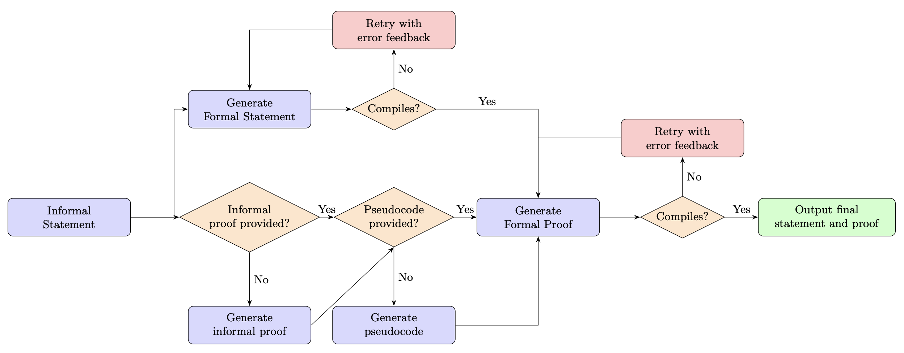

# Neumann Prover 🎨

**Neumann-Prover** is an end-to-end, multi-purpose autoformalization tool designed to produce formal proofs in Lean. It uses cutting-edge foundation models from OpenAI, and Anthropic,
as well over as twenty open-source models available via Together, including offerings from DeepSeek, Qwen, and Meta. It offers extraordinary flexibility: not only can users choose which
model to use, they have the option to input an informal statement and/or a formal statement in Lean, as well as the option to input an informal proof. Moreover, the user can choose
whether they want (i) an informal proof, (ii) a formal statement, (iii) Lean pseudocode of a formal proof, or (iv) a formal proof. The model then interacts dynamically with the Lean4 
compiler to iterate until it produces a correct result.

## Pipeline overview 🚀
The following diagram summarizes neumann-prover's workflow.




### Features 

- **Text-to-Proof Automation**: Generate informal proofs, formal statements, and Lean-4 pseudocode from natural language inputs.
- **Formal Statement Verification**: Translate informal mathematical theorem statement into Lean4 code.
- **Integration with Lean Theorem Prover**: Ensures compatibility with Lean and Mathlib.
- **Multi-Model Support**: Seamlessly utilize OpenAI, Anthropic, and Together APIs for diverse functionality.

## Repository Structure 📂

```plaintext
├── neumann-prover/       # Core library
│   ├── __init__.py       # Entry point for library exports
│   ├── pipelines/        # Multi-stage autoformalization pipeline modules
│   ├── providers.py      # Integrations for OpenAI, Anthropic, etc.
│   ├── utils.py          # Utility functions for Lean code extraction
├── scripts/              # Scripts for setup and environment configuration
    └── setup_lean_env.sh # Shell script to configure Lean and Mathlib
├── src/                  # Source package directory
│   └── neumann_prover/
├── pyproject.toml        # Build and dependency configuration
├── README.md             # Project documentation
└── .gitignore            # Files to exclude from version control
```

## Installation 🔧
### Install Using Jupyter Notebook

Follow these step-by-step instructions to set up `neumann-prover` for use in Jupyter Notebook:

#### Step 1: Set up Python Environment
First, create and activate a Python 3.11 environment using `conda`:
```bash
conda create -y -n neumann-prover python=3.11
conda activate neumann-prover
```

#### Step 2: Install JupyterLab and Kernel
Install JupyterLab and the required kernel dependencies:
```bash
pip install jupyterlab ipykernel
```

#### Step 3: Clone the Repository and Install
Clone the `neumann-prover` repository and install it in editable mode:
```bash
git clone git@github.com:rjain2470/neumann-prover.git
cd neumann-prover
pip install -e .
```

**Note**: Use your personal access token (PAT) as the password if prompted during the `git clone` step.

#### Step 4: Add Jupyter Kernel
Add the `neumann-prover` kernel to Jupyter:
```bash
python -m ipykernel install --user --name neumann-prover --display-name "neumann-prover (py311)"
```

#### Step 5: Configure API Keys
Set the required API keys in your shell environment. To do this:

1. Open your shell configuration file (e.g., `.zshrc` or `.bashrc`) in a text editor:
    ```bash
    nano ~/.zshrc
    ```
2. Add the following lines to the file, replacing `___` with your actual API keys:
    ```bash
    export OPENAI_API_KEY="___"
    export ANTHROPIC_API_KEY="___"
    export TOGETHER_API_KEY="___"
    ```
3. Save the changes (`Ctrl+O`), and exit the editor (`Ctrl+X`).
4. Reload your shell configuration to apply the changes:
    ```bash
    source ~/.zshrc
    ```

#### Step 6: Start Jupyter Lab
Activate the environment and start Jupyter Lab:
```bash
conda activate neumann-prover
jupyter lab
```

Inside Jupyter, select the kernel titled `neumann-prover (py311)`.

#### Step 7: Set Up the Project Environment
Once inside a Jupyter Notebook, finalize the setup by running the following commands:

```python
%pip install -e /Users/jain/neumann-prover > /dev/null 2>&1

import os, subprocess
repo = "/Users/jain/neumann-prover"
os.chdir(repo)
subprocess.run(["bash", "scripts/setup_lean_env.sh"], stdout=subprocess.DEVNULL, stderr=subprocess.DEVNULL, check=True)
from neumann_prover import ask_llm, list_stages, default_model_for
from neumann_prover.utils import extract_lean_code, ensure_import_mathlib, compile_lean_snippet
from neumann_prover.providers import _provider_for
from neumann_prover.pipelines import informal_proof_generator, lean_pseudocode_generator, formal_statement_generator, formal_proof_generator, run_pipeline, batch
from neumann_prover.correction import formal_statement_corrector, formal_statement_until_compiles, try_formal_proof_until_compiles
```

Replace `/path/to/neumann-prover` with the actual path where you cloned the repository.

That's it! You are now ready to use `neumann-prover` for its full range of features. 🎉

---

### 2. Regular Python Installation (Optional)
If you want to use `neumann-prover` in a standard Python environment outside of Jupyter:

1. Clone the repository:
    ```bash
    git clone git@github.com:rjain2470/neumann-prover.git
    cd neumann-prover
    ```
2. Install the requirements:
    ```bash
    pip install -e .
    ```
3. Set up the Lean environment:
    ```bash
    bash scripts/setup_lean_env.sh
    ```

You’re all set! Refer to the usage examples in this README for how to run the tool.

## 📜 Configuration

### Dependencies
The project relies on the following dependencies:
- `openai>=1.0.0`
- `anthropic>=0.30.0`
- `together>=0.2.0`
- `tqdm>=4.66.0`

Ensure these dependencies are installed via `pyproject.toml`.

### Environment Variables
API keys must be set for the respective providers:
- **OpenAI**: Set `OPENAI_API_KEY` in your environment.
- **Anthropic**: Add `ANTHROPIC_API_KEY`.
- **Together**: Configure with `TOGETHER_API_KEY`.

To set API keys:
```bash
export OPENAI_API_KEY="your-openai-key"
export ANTHROPIC_API_KEY="your-anthropic-key"
export TOGETHER_API_KEY="your-together-key"
```

### Example Usage
Here is an example of how one might use this repo to generate the formal statement from an informal statement.
```python
informal_text = "For every even integer n, 4 divides n^2."
print(formal_statement_until_compiles(informal_text, model="gpt-5-mini", max_iters=2))
```
Output:
```
=== Attempt 1/2 (Formal Statement) ===
File successfully compiled!
import Mathlib

namespace Demo

def even (n : Int) : Prop := ∃ k : Int, n = 2 * k

def divides (a b : Int) : Prop := ∃ k : Int, b = a * k

theorem four_dvd_square_of_even : ∀ n : Int, even n → divides 4 (n * n) := by
  sorry

end Demo
```
One can also use neumann-prover to formalize batches of statements/proofs. Here is an example with a batch of size 1.
```python
import json
examples = [
    {
        "id": "ex1",
        "informal_text": "For every even integer n, 4 divides n^2.",
        "informal_proof": "If n is even, n=2k, then n^2=(2k)^2=4k^2, so divisible by 4."
    }
]

with open("examples.jsonl", "w") as f:
    for ex in examples:
        f.write(json.dumps(ex) + "\n")

!neumann-prover --inputs examples.jsonl --outdir ./out --interactive false

with open("./out/records.jsonl") as f:
    records = [json.loads(line) for line in f]

with open("./out/summary.json") as f:
    summary = json.load(f)

print("Number of records:", len(records))
print("First record keys:", records[0].keys())
print("\nSummary:", summary)
first = records[0]

print("\nFormal Statement:\n", first.get("formal_statement", ""))
print("\nFormal Proof:\n", first.get("formal_proof", ""))
```
Output:
```
✅ Wrote examples.jsonl
Will generate missing informal proofs with gpt-5-mini.
Will generate missing pseudocode with gpt-5-mini.
Will generate/correct missing formal statements with gpt-5-mini.
Will generate/correct missing formal proofs with gpt-5.
[run_pipeline] Done.
  Items: 1
  Formal statements compiled: 1
  Formal proofs compiled:     1

Number of records: 1
First record keys: dict_keys(['input', 'informal_proof', 'pseudocode', 'formal_statement', 'formal_proof'])

Summary: {'n_items': 1, 'statements_compiled': 1, 'proofs_compiled': 1, 'elapsed_sec': 175.06}

Formal Statement:
 {'text': 'import Mathlib\n\nnamespace Demo\n\ndef EvenInt (n : Int) : Prop := ∃ k : Int, n = 2 * k\n\ntheorem even_int_square_div_by_four : ∀ n : Int, EvenInt n → (4 : Int) ∣ n^2 := by\n  sorry\n\nend Demo\n', 'compiled': True, 'stdout': "Main.lean:7:8: warning: declaration uses 'sorry'", 'stderr': ''}

Formal Proof:
 {'text': 'import Mathlib\n\nnamespace Demo\n\ndef EvenInt (n : ℤ) : Prop := ∃ k : ℤ, n = 2 * k\n\ntheorem even_square_divisible_by_four :\n    ∀ n : ℤ, EvenInt n → (4 : ℤ) ∣ n ^ 2 := by\n  intro n h\n  rcases h with ⟨k, hk⟩\n  refine ⟨k ^ 2, ?_⟩\n  have hcalc : (2 * k) * (2 * k) = (4 : ℤ) * (k * k) := by\n    ring\n  simpa [hk, pow_two] using hcalc\n\nend Demo\n', 'compiled': True, 'stdout': '', 'stderr': ''}
```
---

## License 📄
This project is licensed under the MIT License. See the [LICENSE](LICENSE) file for details.

---

## Acknowledgments ❤️
Thanks to OpenAI, Anthropic, and Together for access to the foundation models which made this project possible.
